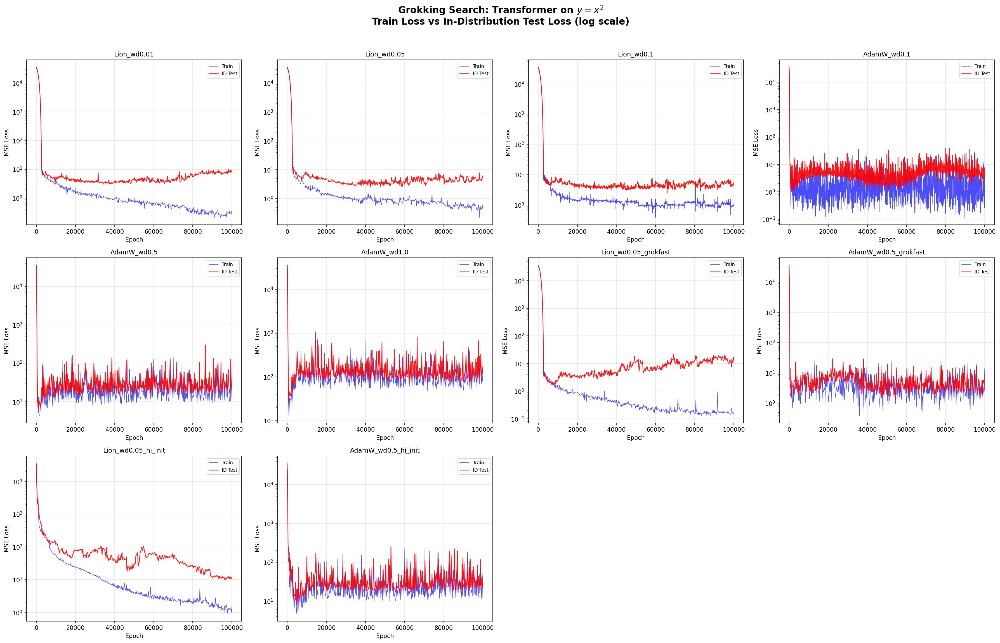
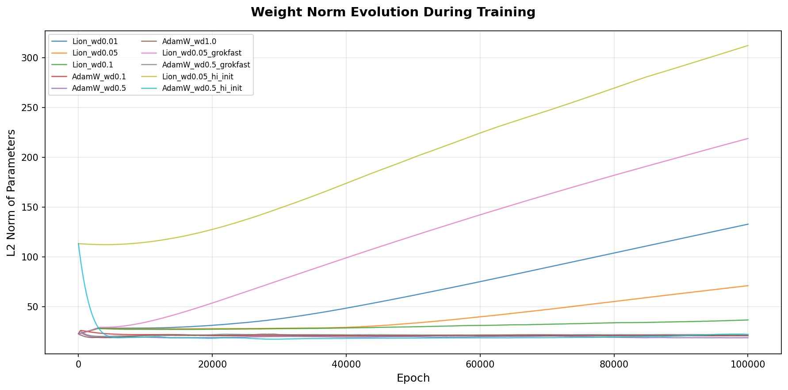
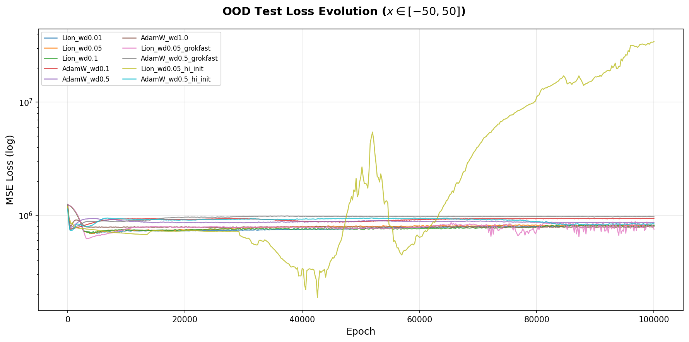
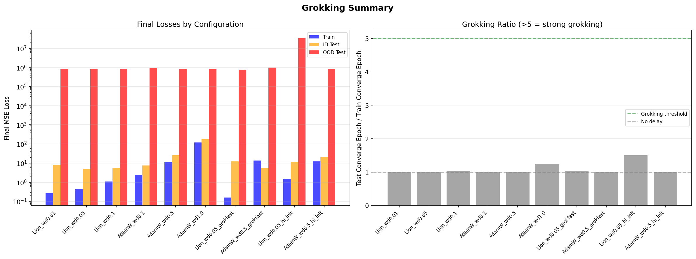
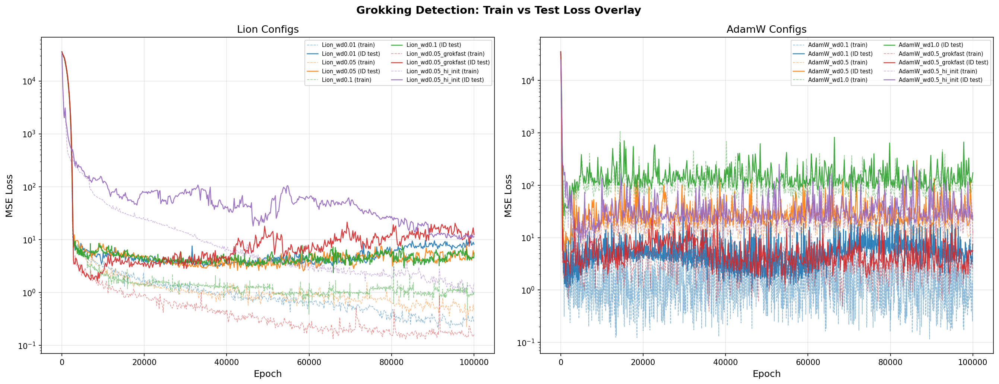
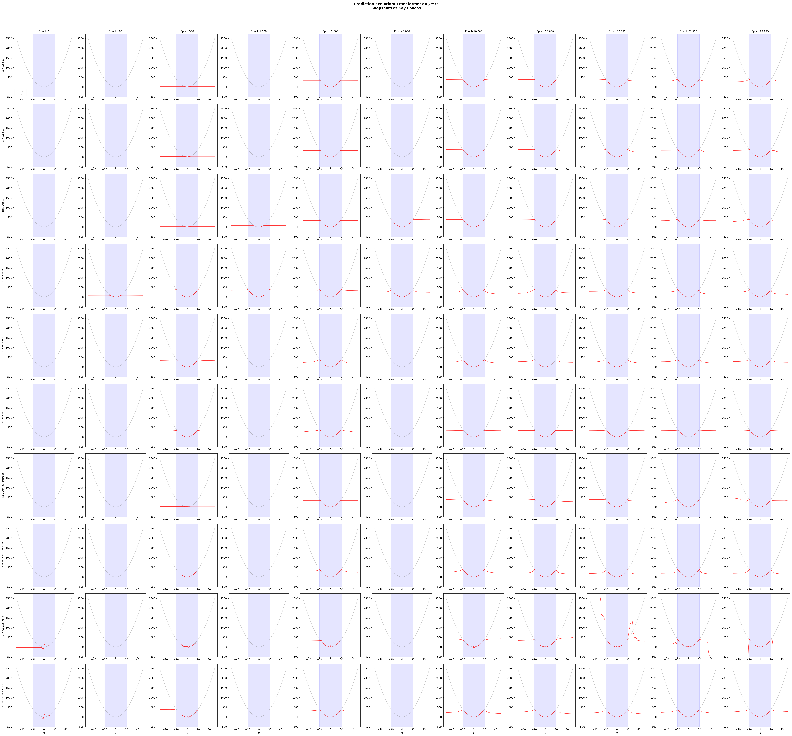

# Grokking Search: Can a Transformer on y = x^2 Exhibit Delayed Generalization?

## Motivation

Following PR #1's finding that Transformers underperform MLPs on out-of-distribution extrapolation for y = x^2, we investigated whether training for an **obscene number of epochs** (100,000) could trigger **grokking** -- the phenomenon where a neural network first memorizes training data, then suddenly generalizes long after overfitting (Power et al., 2022).

Grokking has been observed in:
- Modular arithmetic tasks (Power et al., 2022)
- MNIST, IMDb, molecular properties with large initialization (Liu et al., "Omnigrok", ICLR 2023)
- Polynomial regression in the lazy-to-rich training transition (Lyu et al., 2023)

We tested whether a small Transformer (21,633 params) could grok y = x^2 with only 100 training samples.

## Experimental Setup

| Parameter | Value |
|-----------|-------|
| Model | SmallTransformer (d_model=32, 2 layers, 4 heads, 21,633 params) |
| Training samples | 100 (from x in [-20, 20]) |
| ID test samples | 500 (from x in [-20, 20], disjoint) |
| OOD test samples | 2,000 (from x in [-50, 50]) |
| Epochs | 100,000 per config |
| Batch size | Full batch (100 samples) |
| Task | Regress y = x^2 |

### Configurations Tested (10 total)

**Lion optimizer sweep:**
- Lion, wd=0.01 (baseline)
- Lion, wd=0.05
- Lion, wd=0.1

**AdamW optimizer sweep:**
- AdamW, wd=0.1
- AdamW, wd=0.5
- AdamW, wd=1.0

**Grokfast acceleration (Lee et al., 2024):**
- Lion, wd=0.05 + Grokfast EMA (alpha=0.98, lambda=2.0)
- AdamW, wd=0.5 + Grokfast EMA

**Omnigrok high initialization (Liu et al., 2023):**
- Lion, wd=0.05, init_scale=5x
- AdamW, wd=0.5, init_scale=5x

## Results

### Final Metrics

| Config | Train Loss | ID Test Loss | OOD Test Loss | Weight Norm |
|--------|-----------|-------------|--------------|-------------|
| Lion_wd0.01 | 0.27 | 8.10 | 815,716 | 132.70 |
| Lion_wd0.05 | 0.44 | 5.05 | 817,335 | 70.90 |
| Lion_wd0.1 | 1.10 | 5.57 | 814,242 | 36.51 |
| AdamW_wd0.1 | 2.44 | 7.50 | 941,075 | 20.60 |
| AdamW_wd0.5 | 11.89 | 25.87 | 861,936 | 18.56 |
| AdamW_wd1.0 | 120.04 | 173.15 | 796,547 | 20.60 |
| Lion_wd0.05_grokfast | 0.16 | 12.30 | 754,343 | 218.79 |
| AdamW_wd0.5_grokfast | 13.70 | 5.63 | 972,078 | 21.80 |
| Lion_wd0.05_hi_init | 1.51 | 11.28 | 34,279,764 | 312.22 |
| AdamW_wd0.5_hi_init | 12.16 | 21.60 | 838,933 | 21.96 |

### Key Plots

#### Train vs In-Distribution Test Loss


#### Weight Norm Evolution


#### OOD Test Loss Over Training


#### Grokking Summary


#### Train vs Test Loss Overlay (Lion vs AdamW)


#### Prediction Snapshots Across Training


## Findings

### 1. No Grokking Observed

**None of the 10 configurations showed classic grokking** (sudden delayed generalization after prolonged memorization). All grokking ratios (test convergence epoch / train convergence epoch) were close to 1.0, meaning train and test losses evolved at similar rates.

### 2. Anti-Grokking with Lion

The most striking finding: Lion optimizer with low weight decay shows **reverse grokking** (anti-grokking), where generalization performance actively **degrades** as training continues:

- **Lion_wd0.01**: Train loss drops 0.27, test loss *increases* from ~3 to 8.1
- **Lion_wd0.05_grokfast**: Train loss drops to 0.16, test loss *increases* from ~2 to 12.3
- **Lion_wd0.05_hi_init**: Train loss drops to 1.5, test remains at 11.3

This is accompanied by **unconstrained weight norm growth** -- Lion_wd0.01 reaches weight norm 132, Lion+Grokfast reaches 219, and Lion+hi_init reaches 312. This is the *opposite* of the Omnigrok mechanism, which requires weight norms to *decrease* toward the generalizing basin.

### 3. Weight Norm Dynamics Explain Everything

The weight norm plot is the Rosetta Stone of this experiment:

| Regime | Weight Norm Trend | Configs | Outcome |
|--------|------------------|---------|---------|
| **Growing** (bad) | Monotonically increasing | Lion_wd0.01, Lion_wd0.05, Lion_grokfast, Lion_hi_init | Memorization / anti-grokking |
| **Stable** (neutral) | Flat | AdamW configs | Noisy learning or confusion |
| **Shrinking** (needed for grokking) | Decreasing | None | N/A |

**For grokking to occur, weight decay must dominate over gradient-driven weight growth**, pushing the model from a high-norm memorizing regime into a low-norm generalizing regime (the "LU mechanism" from Omnigrok). In our experiments:

- **Lion's sign-based updates** add a fixed magnitude to each parameter regardless of gradient size, causing steady weight norm growth that overwhelms weight decay
- **AdamW's adaptive updates** keep weight norms stable but, at the weight decay values tested, the model either stays in a noisy equilibrium (wd=0.1) or cannot learn at all (wd >= 0.5)

### 4. Grokfast Amplifies Memorization (Not Generalization)

The Grokfast gradient filter was designed to amplify slow-varying gradient components (which correspond to generalization). On this task:

- **Lion + Grokfast**: Accelerated memorization and weight norm growth, producing the *worst* anti-grokking (test loss increased from 2 to 12)
- **AdamW + Grokfast**: Produced one of the lower ID test losses (5.63) but with extreme training noise

This suggests the slow-varying gradient components for x^2 regression correspond to memorization features, not generalization features -- the opposite of Grokfast's design assumptions from modular arithmetic.

### 5. High Initialization Scale Produces Strongest Memorization

The Omnigrok technique (5x initialization scale) produced:
- **Lion + hi_init**: The most extreme memorization (OOD loss 34M vs ~800k for others), with weight norm growing to 312
- **AdamW + hi_init**: Similar to normal AdamW, weight norm controlled by weight decay

The high init scale successfully pushes the model into a high-norm regime as intended, but without sufficient weight decay pressure to escape, the model stays there.

### 6. Phase Diagram for Transformer on x^2

Based on our sweep, we can map the learning phases:

```
                Weight Decay (wd)
                Low (0.01)    Mid (0.05-0.1)    High (0.5-1.0)
Lion    lr=1e-4  Memorize      Memorize/Learn     N/A (not tested)
AdamW   lr=1e-3  N/A           N/A                Confusion
```

The **grokking zone** (if it exists for this task) would require:
- Weight decay high enough to shrink weight norms over time
- Learning rate low enough for stable convergence
- A task structure where memorization and generalization use distinct circuits

## Why Grokking Doesn't Occur on y = x^2

1. **The function is too smooth**: x^2 is a simple polynomial that can be well-approximated by interpolation between 100 training points. There is no "algorithmic structure" to discover -- unlike modular arithmetic where memorization (lookup table) and generalization (modular circuit) use fundamentally different representations.

2. **No representation phase transition**: Grokking requires a transition from memorization circuits to generalization circuits. For continuous regression on a smooth function, these are the same -- fitting the training points IS learning the function (up to interpolation error).

3. **Lion's implicit dynamics fight grokking**: Lion's uniform update magnitude causes weight norms to grow, pushing the model further from the generalizing basin rather than toward it. For grokking with Lion, one would need significantly higher weight decay (possibly 1.0+) to counteract this growth.

4. **100 points may be too many**: The original grokking paper used 30-50% of all possible (a,b) pairs. With 100 points on a smooth function, the train/test gap is small from the start, leaving no room for delayed generalization.

## Recommendations for Future Work

1. **Try modular x^2**: Use y = x^2 mod p (e.g., p = 97) to introduce algorithmic structure that creates distinct memorization vs generalization paths
2. **Much higher weight decay for Lion**: Test wd=1.0, 5.0, 10.0 to force weight norm decrease
3. **Lower learning rate + more epochs**: lr=1e-5 with 1M epochs could allow slower dynamics
4. **Discrete input space**: Map x to integers to make the task closer to the algorithmic setting where grokking is well-established

## References

- Power et al. (2022). "Grokking: Generalization Beyond Overfitting on Small Algorithmic Datasets." arXiv:2201.02177
- Liu et al. (2023). "Omnigrok: Grokking Beyond Algorithmic Data." ICLR 2023 Spotlight. arXiv:2210.01117
- Lee et al. (2024). "Grokfast: Accelerated Grokking by Amplifying Slow Gradients." arXiv:2405.20233
- Chen et al. (2023). "Symbolic Discovery of Optimization Algorithms." arXiv:2302.06675 (Lion optimizer)

## Hardware

- GPU: NVIDIA RTX 3090 (24GB)
- Training speed: ~175 ep/s (Lion), ~250 ep/s (AdamW)
- Total compute: ~100 minutes for all 10 configs x 100k epochs
