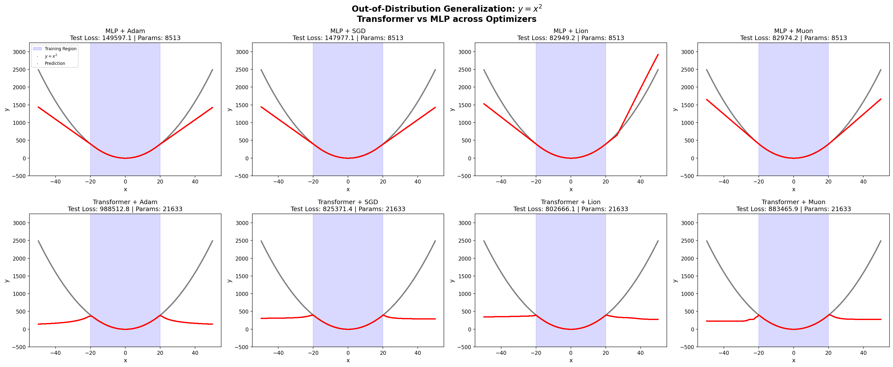
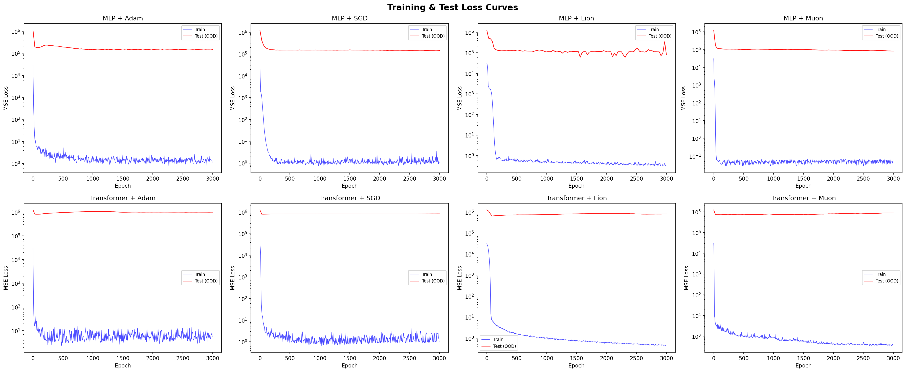
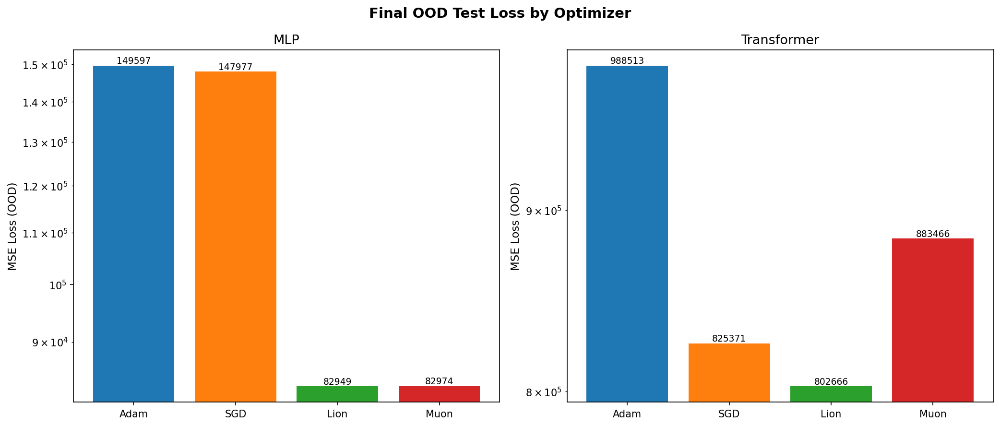
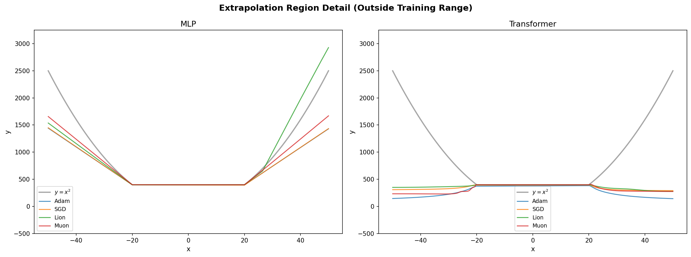

# Transformer vs MLP: Out-of-Distribution Generalization on y = x^2

## Experiment Setup

- **Task**: Approximate y = x^2 and test extrapolation beyond training range
- **Training Range**: x in [-20, 20] (10,000 samples)
- **Test Range**: x in [-50, 50] (10,000 samples)
- **Epochs**: 3,000
- **Batch Size**: 256
- **Architectures**: MLP (3 hidden layers, width 64) vs Small Transformer (2 layers, d_model=32, 4 heads)
- **Optimizers**: Adam, SGD, Lion, Muon

## Model Sizes

| Model | Parameters |
|-------|-----------|
| MLP_Adam | 8,513 |
| MLP_SGD | 8,513 |
| MLP_Lion | 8,513 |
| MLP_Muon | 8,513 |
| Transformer_Adam | 21,633 |
| Transformer_SGD | 21,633 |
| Transformer_Lion | 21,633 |
| Transformer_Muon | 21,633 |

## Results Summary

| Architecture | Optimizer | Final Train Loss | Final OOD Test Loss |
|-------------|-----------|-----------------|-------------------|
| MLP | Adam | 1.46 | 149597.12 |
| MLP | SGD | 1.09 | 147977.06 |
| MLP | Lion | 0.34 | 82949.18 |
| MLP | Muon | 0.05 | 82974.21 |
| Transformer | Adam | 5.89 | 988512.75 |
| Transformer | SGD | 1.26 | 825371.38 |
| Transformer | Lion | 0.46 | 802666.12 |
| Transformer | Muon | 0.39 | 883465.94 |

## Visualizations

### Final OOD Predictions

### Training & Test Loss Curves

### Optimizer Comparison (Final OOD Loss)

### Extrapolation Region Detail

## Analysis

**Best OOD Generalization**: MLP_Lion with test loss 82949.18

- **MLP**: Best optimizer is Lion (OOD loss: 82949.18)
- **Transformer**: Best optimizer is Lion (OOD loss: 802666.12)

### Optimizer Rankings (by OOD Test Loss)

- **Adam**: Average OOD loss = 569054.94
- **SGD**: Average OOD loss = 486674.22
- **Lion**: Average OOD loss = 442807.65
- **Muon**: Average OOD loss = 483220.07

### Key Observations

1. **In-distribution fit**: All optimizers can fit x^2 within the training range [-20, 20].
2. **Extrapolation**: The critical test is how well each model/optimizer combo extends beyond [-20, 20].
3. **Architecture effect**: Transformers and MLPs may learn fundamentally different representations,
   leading to different extrapolation behaviors.
4. **Optimizer effect**: Different optimizers find different local minima, which can dramatically
   affect out-of-distribution behavior even when in-distribution performance is similar.
